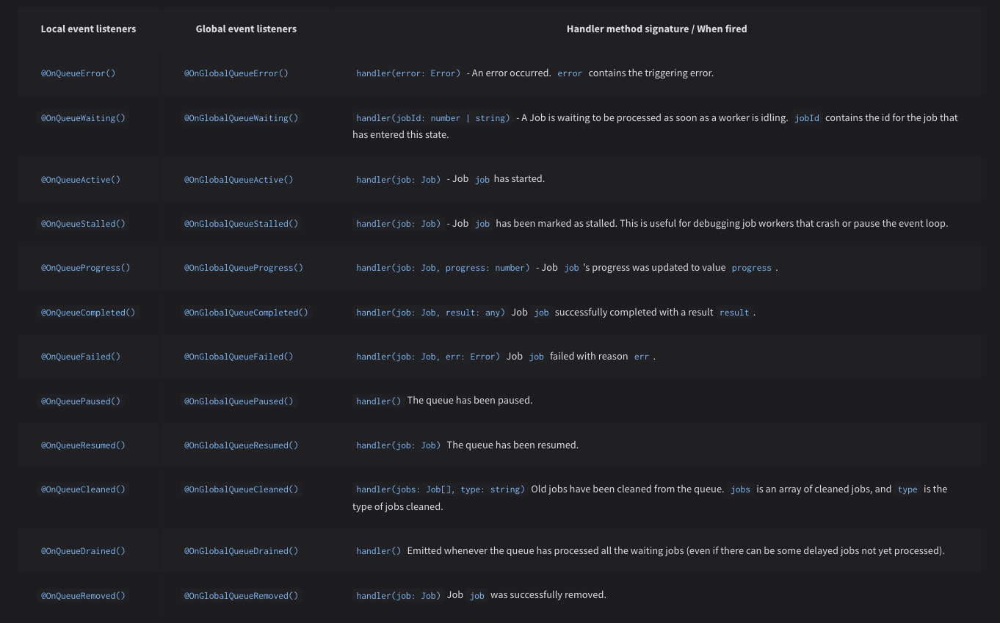

## Introduction and Key Concepts

In modern application systems, it is common to encounter the need to handle background tasks.

Node.js is a runtime environment that operates on a single-threaded model with an event loop. This means that all operations are executed in one main thread, which could cause blocking if heavy tasks are not managed properly.

This is where queue systems and asynchronous handling become fundamental, as they allow distributing the workload and preventing intensive tasks from affecting the overall performance of the application.

In modern applications, there are various scenarios where we need to handle certain types of tasks in such a way that they do not affect the main flow. To address these scenarios (such as sending emails, generating certain documents, processing data, etc.), background processing strategies have been developed that allow tasks to be executed asynchronously and in a distributed manner.

In this article, we will explore how to implement a queue system using Bull and Redis in a NestJS application.

### Why Use Queues?

In modern systems with variable loads and asynchronous operations, queues:

- Prevent blocking in the Node.js main thread
- Allow distributed processing
- Provide automatic retry mechanisms
- Facilitate horizontal scalability

## What is Bull?

Bull is a work queue library based on `Redis` that allows us to handle background tasks efficiently.

> **Redis** is an in-memory database used to store the state of tasks. Thanks to its high speed and persistence capability, it ensures that job information remains available even if the system restarts.

Bull offers advanced features for asynchronous task processing:

- **Distributed Queue Management with Redis**
  - It allows tasks to be distributed among multiple instances of the application using Redis. This facilitates horizontal scalability and ensures that tasks are processed efficiently even under high load.
- **Configurable Delays and Automatic Repeats**
  - It offers the ability to schedule tasks to be executed in the future and set repetition patterns (such as daily or weekly tasks). It also allows configuring automatic retries in case of failures.
- **Concurrency Handling and Rate Limiting**
  - It is possible to control how many jobs can run concurrently and to set speed limits to avoid overload. This is crucial for maintaining system stability and respecting limits of external APIs.
- **Data Persistence**
  - Bull uses Redis as a storage system to save the state of tasks. This allows maintaining a complete record of all jobs, including those that have been executed, those that have failed, and those that are pending. The advantage of this system is that the information persists even if the system restarts.
- **Error Handling and Retries**
  - With Bull, it is simple to implement strategies to handle failures, including retries, detailed error logs, and notifications when jobs repeatedly fail.
- **Job Prioritization**
  - It allows assigning different priority levels to tasks, ensuring that the most important jobs are processed first.

## Initial Configuration

To start working with Bull, you need to have a running Redis instance and install the necessary dependencies:

### Installation

```bash
$ npm install --save @nestjs/bull bull
```

### Module Configuration

Create a dedicated module to handle the queues, for example, `queue.module.ts`.

```tsx
import { Module } from '@nestjs/common';
import { BullModule } from '@nestjs/bull';
import { QueueService } from './queue.service';
import { QueueProcessor } from './queue.processor';

@Module({
	imports: [
		BullModule.forRoot({
			redis: {
				host: process.env.REDIS_HOST || 'localhost',
				port: process.env.REDIS_PORT || 6379,
			},
		}),
		BullModule.registerQueue({
			name: 'email', // Name of the queue
		}),
	],
	providers: [QueueService, QueueProcessor],
	exports: [QueueService],
})
export class QueueModule {}
```

## Named Configurations

Named configurations are a feature provided by the Bull module for Nest that allows managing several work queues within the same application in an organized and efficient manner. This is particularly useful when you need to handle background tasks with different configurations or purposes.

They allow you to separate and customize each work queue, ensuring that each type of task is executed with the appropriate parameters, such as the Redis connection, retry options, or concurrency limits.

```tsx
BullModule.forRoot('alternative-config', {
	connection: {
		port: 6381,
	},
});
```

Once this configuration is created, we can create queues referring to it:

```tsx
BullModule.registerQueue({
	configKey: 'alternative-config',
	name: 'video',
});
```

In this way, these types of configurations provide **modularity**, **scalability**, and **flexibility** by configuring different parameters such as concurrency limits, retries, etc., according to the needs of each type of task.

### Job Processor

Create a `processor` to handle the queue tasks.

Bull decorators are used to define the processing function and to listen for relevant events such as the start and completion of jobs.

```tsx
import {
	Processor,
	Process,
	OnQueueActive,
	OnQueueCompleted,
} from '@nestjs/bull';
import { Job } from 'bull';
import { Logger } from '@nestjs/common';

@Processor('email')
export class QueueProcessor {
	private readonly logger = new Logger(QueueProcessor.name);

	// Listener: Job has started
	@OnQueueActive()
	onActive(job: Job) {
		this.logger.debug(`Processing job ${job.id} of type ${job.name}`);
	}

	@Process('send-email')
	async handleSendEmail(job: Job) {
		this.logger.debug('Starting email send to ' + job.data.recipient);

		try {
			// Implementation of email sending
			await this.sendEmail(job.data);
			this.logger.debug('Email sent successfully');
		} catch (error) {
			this.logger.error('Error sending email:', error);
			throw error;
		}
	}

	// Listener: Job finished
	@OnQueueCompleted()
	onCompleted(job: Job) {
		this.logger.debug(`Completed job ${job.id} of type ${job.name}`);
	}
}
```

The available events are listed in the [official documentation](https://docs.nestjs.com/techniques/queues#event-listeners-1).



### Queue Service

The queue service encapsulates the logic for adding jobs to the queue. In the following example, it shows how to enqueue a job for sending emails, configuring delays, retries, and backoff strategies.

```tsx
import { Injectable } from '@nestjs/common';
import { InjectQueue } from '@nestjs/bull';
import { Queue } from 'bull';

@Injectable()
export class QueueService {
	constructor(@InjectQueue('email') private readonly emailQueue: Queue) {}

	async addEmailJob(data: {
		recipient: string;
		subject: string;
		body: string;
		attachments?: any[];
	}) {
		return await this.emailQueue.add('send-email', data, {
			delay: 5000, // 5-second delay
			attempts: 3, // 3 attempts
			backoff: {
				type: 'exponential',
				delay: 1000,
			},
			removeOnComplete: true,
		});
	}
}
```

### Controller Implementation

Finally, here is an example of a controller that exposes an endpoint to schedule email sending through the queue service.

```tsx
import { Controller, Post, Body } from '@nestjs/common';
import { QueueService } from './queue.service';

@Controller('email')
export class EmailController {
	constructor(private readonly queueService: QueueService) {}

	@Post('send')
	async sendEmail(
		@Body() body: { recipient: string; subject: string; body: string }
	) {
		await this.queueService.addEmailJob(body);
		return { message: 'Email scheduled successfully' };
	}
}
```

## Common Use Cases

This type of system is used in scenarios where it is necessary to execute tasks without blocking the main application flow, for example:

- Processing heavy data and files.
- Generating reports or PDFs.
- Synchronizing with external services.
- Mass notifications and sending emails.
- Media transcoding.
- Executing scheduled and recurring tasks.
- Data synchronization between systems.

## Best Practices and Final Considerations

- **Environment Variables:**

  Use environment variables to configure critical parameters (such as the Redis connection).

- **Error Handling:**

  Implement robust strategies for error handling and retries in asynchronous processes. It is also recommended to add detailed logs and, if possible, alerts in case of repeated failures. (For more info, refer to the `logs` section)

- **Scalability:**

  Taking advantage of Bull's capabilities to manage distributed queues and limit concurrency allows the application to scale horizontally as the workload increases.

- **Dead Letter Queue (DLQ):**

  It is advisable to configure a Dead Letter Queue for jobs that, after several retries, continue to fail. The DLQ allows separating and storing these jobs for later analysis or manual reprocessing. By using a DLQ, erroneous jobs are prevented from affecting the main queue flow, making it easier to identify and correct issues in the processing logic.

  _Suggested Implementation:_

  - Define an additional queue (for example, `dead-letter`) to store jobs that have exceeded the maximum number of attempts.
  - Configure the main queue to redirect failed jobs to the DLQ. This can be done through error handling logic in the processor or through advanced Bull configurations.
  - Monitor the DLQ periodically to analyze and retry jobs, or to notify the support team.
  - For more information on DLQ, visit [here](https://aws.amazon.com/es/what-is/dead-letter-queue/).

---
