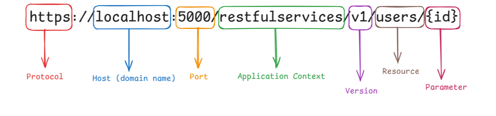

# Standard REST API

A REST API is a type of communication interface between systems that follows the principles of REST architecture, allowing applications and web services to communicate with each other over the HTTP protocol.

The REST API standard is a set of principles and constraints for designing a REST API. These guidelines help maintain consistent practices, benefiting both the development team and the API's users by making it more predictable, easy to understand, and maintainable. Below are the key principles and practices that define a standard REST API.

## OpenAPI Specification (OAS)

To further support these standards, the OpenAPI Specification (OAS) has become a widely adopted guideline for designing and documenting REST APIs. OpenAPI defines a set of rules to describe an API's structure, allowing developers and consumers to understand and test API functionalities in a structured and standardized way. This specification not only ensures consistency in documentation but also supports the generation of visual and interactive tools, such as Swagger UI, which enhance the developer experience and facilitate integration across systems.

Together, these principles and the OpenAPI Specification provide a comprehensive approach to building and documenting REST APIs, creating a consistent, user-friendly interface that is easier to navigate and integrate.



---

## Resources and URLs

Everything is considered a resource (e.g., users, orders, products). Resources are accessed via URIs (Uniform Resource Identifiers), endpoints.

### Use nouns, not verbs

Use nouns to represent resources, not verbs. It's common to use nouns for endpoints and HTTP methods for actions.

The URIs shouldn't indicate any CRUD (Create, Read, Update, Delete) operations.
Additionally avoid verb-noun combinations: hyphenated, snake_case, camelCase.

**Bad examples:**

```
http://api.example.com/v1/store/CreateItems/{item-id}     ❌
http://api.example.com/v1/store/getEmployees/{emp-id}     ❌
http://api.example.com/v1/store/update-prices/{price-id}  ❌
http://api.example.com/v1/store/deleteOrders/{order-id}   ❌
```

**Good examples:**

```
POST   http://api.example.com/v1/store/items/{item-id}      ✅
GET    http://api.example.com/v1/store/employees/{emp-id}   ✅
PATCH  http://api.example.com/v1/store/prices/{price-id}    ✅
DELETE http://api.example.com/v1/store/orders/{order-id}    ✅
```

### Use Pluralized Nouns for resources

Use plural when possible unless they are singleton resources.

**Bad examples:**

```
http://api.example.com/v1/store/item/{item-id}              ❌
http://api.example.com/v1/store/employee/{emp-id}/address   ❌
```

**Good examples:**

```
http://api.example.com/v1/store/items/{item-id}             ✅
http://api.example.com/v1/store/employees/{emp-id}/address  ✅
```

Use the plural form whenever applicable, except when referring to unique or singular resources.

### Use hyphens (`-`) to improve the readability of URIs

Avoid using underscores. Separating words with hyphens will make it easier for both you and others to understand. It is more user-friendly, especially for long-path segmented URIs.

**Bad examples:**

```
http://api.example.com/v1/store/teammember/{team-id}                        ❌
http://api.example.com/v1/store/itemmanagement/{item-id}/producttype        ❌
http://api.example.com/v1/store/inventory_items                             ❌
```

**Good examples:**

```
http://api.example.com/v1/store/team-member/{team-id}                       ✅
http://api.example.com/v1/store/items/{item-id}/product-types               ✅
http://api.example.com/v1/store/inventory-items                             ✅
```

---

## Query Params or Path Params?

### Use query params to filter URI collection

It's common to encounter the need to sort, filter, or limit a collection of resources based on specific attributes. Instead of creating additional APIs for each requirement, enhance your resource collection API to support sorting, filtering, and pagination. Use query parameters to pass the necessary input values to meet these needs efficiently.

```
http://api.example.com/v1/store/items?group=124                         ✅
http://api.example.com/v1/store/employees?department=IT&region=USA      ✅
```

### Path parameters

Use path parameters when you need to identify a specific resource or resource hierarchy. Path parameters represent a unique ID or key that is essential to locating the exact resource in your data structure.

```
http://api.example.com/v1/store/users/124              ✅
http://api.example.com/v1/store/users/124/orders/234   ✅
```

**Bad examples:**

```
http://api.example.com/v1/products/electronics        ❌  (Filtering resources)
http://api.example.com/v1/articles/page/2/limit/10    ❌  (Pagination)
http://api.example.com/v1/users?userId=12345          ❌  (Identify a specific resource)
```

**Good examples:**

```
http://api.example.com/v1/products?category=electronics   ✅  (Filtering resources)
http://api.example.com/v1/articles?page=2&limit=10        ✅  (Pagination)
http://api.example.com/v1/users/12345                     ✅  (Identify a specific resource)
```

### Hierarchical Path Parameters

Hierarchical path parameters represent a natural "parent-child" relationship between resources. This structure helps express relationships within the URL by nesting a child resource under its parent, making it easy to understand contextually related data.

Avoid using this structure for unrelated resources or excessive nesting, as it can lead to overly complex URLs.

**Bad examples:**

```
http://api.example.com/v1/companies/12/departments/34/teams/56/employees/78   ❌
http://api.example.com/v1/users/12345/products/67890                          ❌  (No relation between both resources)
```

**Good examples:**

```
http://api.example.com/v1/projects/789/tasks/42        ✅
http://api.example.com/v1/users/12345/orders/67890     ✅
```

---

## HTTP Methods and CRUD Operations

Each HTTP method aligns with CRUD operations, allowing for clear and structured interactions with resources in a REST API.

| Method   | Action                                          | Example                                      |
|----------|-------------------------------------------------|----------------------------------------------|
| `GET`    | Retrieve a resource                             | `GET http://api.example.com/v1/users/8345`   |
| `POST`   | Create a new resource                           | `POST http://api.example.com/v1/users`       |
| `PUT`    | Update an existing resource or create if absent | `PUT http://api.example.com/v1/users/8345`   |
| `PATCH`  | Partially update an existing resource           | `PATCH http://api.example.com/v1/users/8345` |
| `DELETE` | Remove a resource                               | `DELETE http://api.example.com/v1/users/8345`|

### NestJS CRUD Generator

> **TIP:** NestJS provides a built-in CRUD generator that scaffolds the controller, service, module, and DTOs for a resource in one command. Use it as the starting point for any new resource to keep the structure consistent across the project.
>
> [NestJS CRUD Generator →](https://docs.nestjs.com/recipes/crud-generator)

---

## Authentication-related actions

While the principle of using nouns for resources generally applies to RESTful APIs, authentication-related actions often deviate from this pattern. This is because the nature of authentication endpoints is typically more action-oriented rather than resource-based. Authentication actions like login, register, and logout represent processes rather than entities, which is why they are often treated as exceptions to the "noun-only" rule.

```
POST /auth/login      // Authenticate and receive an access token.
POST /auth/register   // Register a new user account.
POST /auth/logout     // Invalidate the current access token.
POST /auth/refresh    // Get a new access token with a refresh token.
```

If roles are distinct (e.g., admin vs. user), you might separate endpoints:

```
POST /admin/auth/login   // Admin login
POST /user/auth/login    // User login
```

### Current authenticated user

The `/me` route is a popular REST API convention used to represent the current authenticated user. This route provides a standardized way for clients to access information about the authenticated user without needing to know or specify their user ID explicitly.

The `/me` route is used for:

- **User Profile Retrieval:** Accessing information related to the authenticated user's profile.

  ```
  GET /users/me   ✅
  ```

- **Self-Reference:** Allowing the authenticated user to access their own data without needing their user ID in the URL.

  ```
  GET /users/12345   ❌  (requires the client to know their own ID)

  GET /users/me      ✅
  PATCH /users/me    ✅  (update own profile)
  ```

- **User-Specific Actions:** Performing actions relevant to the authenticated user, such as updating profile details or retrieving personal settings.

  ```
  GET /users/me/orders   ✅
  ```

---

## Versioning

APIs should be versioned to maintain backward compatibility.

> **TIP:** [NestJS versioning](https://docs.nestjs.com/techniques/versioning)

Always try to version your APIs. Versioning allows you to offer an upgrade path without altering the core functionality of the existing APIs. It also lets users know that newer versions of the API are available at the specified fully-qualified URIs.

```
http://api.example.com/v1/store/employees/{emp-id}   ✅
```

Introducing major breaking changes can be avoided by using a versioning scheme like `/v2`.

```
http://api.example.com/v1/store/items/{item-id}                 ✅
http://api.example.com/v2/store/employees/{emp-id}/address      ✅
```

---

## Additional Considerations

### HTTP Status Codes and Error Handling

HTTP status codes in a REST API provide information about the outcome of an API request. They help indicate whether the request was successful, whether there was an error, or whether additional action is required. Effective error handling and using the correct status codes can make APIs more predictable, helping users understand responses.

#### 2xx — Success

| Code | Name | When to use |
|------|------|-------------|
| `200` | OK | Successful `GET`, `PUT`, or `PATCH` request |
| `201` | Created | Successful `POST` that created a new resource |
| `204` | No Content | Successful `DELETE` or action with no response body |

#### 4xx — Client Errors

| Code | Name | When to use |
|------|------|-------------|
| `400` | Bad Request | Malformed request, invalid syntax, or failed validation |
| `401` | Unauthorized | Missing or invalid authentication token |
| `403` | Forbidden | Authenticated but not authorized to access the resource |
| `404` | Not Found | Resource does not exist |
| `409` | Conflict | State conflict (e.g., duplicate entry, version mismatch) |
| `422` | Unprocessable Entity | Request is well-formed but fails business rule validation |

#### 5xx — Server Errors

| Code | Name | When to use |
|------|------|-------------|
| `500` | Internal Server Error | Unexpected server-side failure |
| `503` | Service Unavailable | Server temporarily unable to handle the request |

### Caching

Utilize HTTP caching mechanisms (e.g., `ETag`, `Cache-Control`) to improve performance and reduce server load.

> [NestJS - Caching](https://docs.nestjs.com/techniques/caching#auto-caching-responses)

### Security

- Use HTTPS to encrypt data transmitted between client and server.
- Implement authentication (e.g., OAuth, JWT) and authorization to secure API endpoints.
- Validate and sanitize all inputs to prevent security vulnerabilities.

### Authorization Token Handling

All APIs must use the `Authorization` header with the Bearer scheme to transmit authentication tokens. Use this format in every request that requires authentication:

```
Authorization: Bearer <token>
```

`Bearer` is the authorization scheme type, followed by the token (typically a JWT). This approach keeps the API stateless, works seamlessly across web and mobile clients, and gives full control over token expiration and refresh logic.

---

## Conclusion

In conclusion, implementing these REST API best practices ensures that the team creates an API that is reliable, efficient, and easy to maintain. This approach fosters collaboration, reduces the risk of errors, and enhances the overall developer experience, making it easier to scale and integrate with other systems as your application evolves.

---

## Sources and interest links

- [Swagger OpenAPI Specification](https://swagger.io/specification/)
- [OpenAPI Latest Specification](https://spec.openapis.org/oas/latest.html#openapi-object)
- [NestJS Router Module](https://docs.nestjs.com/recipes/router-module)
- [Azure REST API Design](https://learn.microsoft.com/en-us/azure/architecture/best-practices/api-design)
- [Azure REST API Implementation](https://learn.microsoft.com/en-us/azure/architecture/best-practices/api-implementation)
- [JSON:API - Updating Relationships](https://jsonapi.org/format/#crud-updating-relationships)
